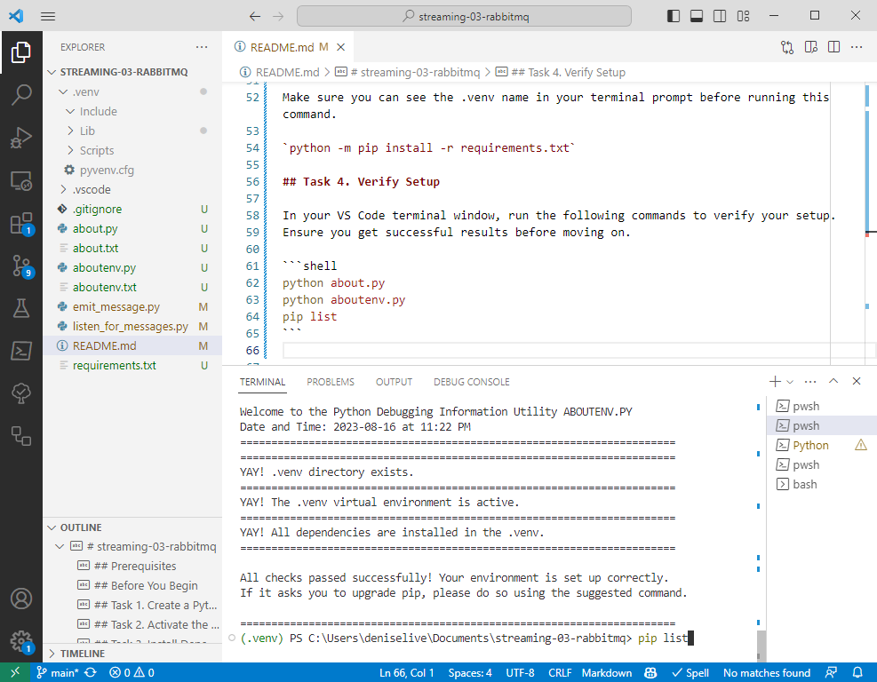
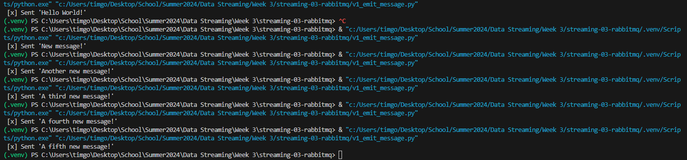
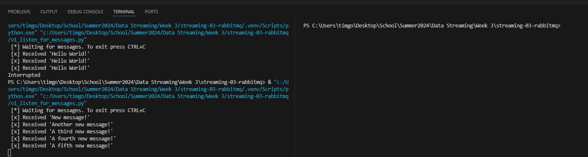
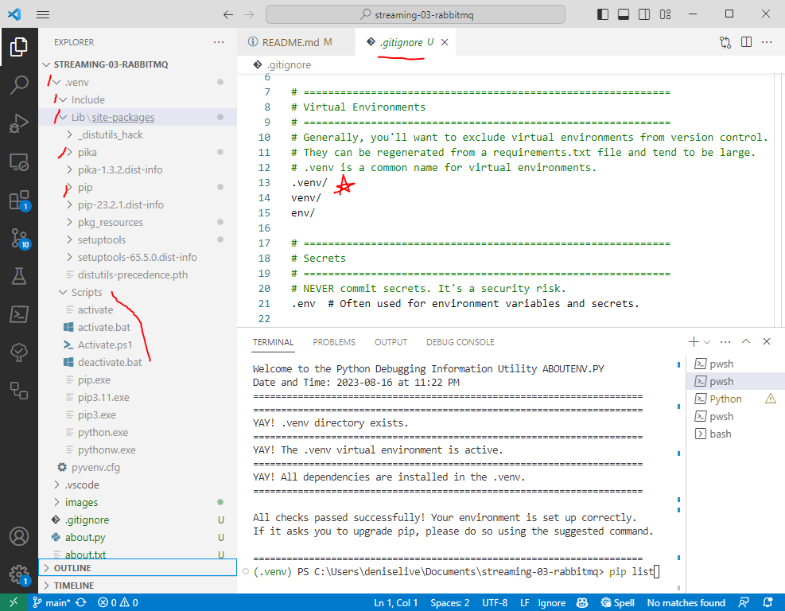

# Tim Gormly
### 5/19/2024

<hr>

# streaming-03-rabbitmq

> Get started with RabbitMQ, a message broker, that enables multiple processes to communicate reliably through an intermediary.

This project requires some free code - beyond that available in the Python Standard Library. To avoid messing up our local default Python installation, and any other Python projects we may have, we  create a local virtual environment to install and use these libraries.

Think of a virtual environment as a safe sandbox. 
We can install whatever we want in our sandbox, and it won't break other Python projects that may require different versions, etc. 

We use the built-in Python utility `venv` to create our virtual environment. 
There are other options, but this is simplest and most common. 
We create the environment as a subfolder of this repo named .venv to keep it away from our project code. 


## Prerequisites

1. Git
1. Python 3.7+ (3.11+ preferred)
1. VS Code Editor
1. VS Code Extension: Python (by Microsoft)
1. RabbitMQ Server installed and running locally

## Before You Begin

1. Fork this starter repo into your GitHub account.
1. Clone your repo down to your machine.
1. Explore your new project repo in VS Code on your local machine.

## Task 1. Create a Python Virtual Environment

We will create a local Python virtual environment to isolate our project's third-party dependencies from other projects.

1. Open a terminal window in VS Code.
1. Use the built-in Python utility venv to create a new virtual environment named `.venv` in the current directory.

```shell
python -m venv .venv
```

Verify you get a new .venv directory in your project. 
We use .venv as the name to keep it away from our project files. 

## Task 2. Activate the Virtual Environment

In the same VS Code terminal window, activate the virtual environment.

- On Windows, run: `.venv\Scripts\activate`
- On Linux/MacOS, run: `source .venv/bin/activate`

Verify you see the virtual environment name (.venv) in your terminal prompt.

## Task 3. Install Dependencies into the Virtual Environment

To work with RabbitMQ, we need to install the pika library.
A library is a collection of code that we can use in our own code.
Learning to use free libraries that others have written to make our projects easier, faster, more reliable is a key skill for a developer.

We keep the list of third-party libraries needed in a file named requirements.txt.
Use the pip utility to install the libraries listed in requirements.txt into our active virtual environment. 

Make sure you can see the .venv name in your terminal prompt before running this command.

`python -m pip install -r requirements.txt`

## Task 4. Verify Setup (OPTIONAL - ONLY WORK ON SOME CONFIGURATIONS)

In your VS Code terminal window, run the following commands to help verify your setup.
These util files MAY be helpful to ensure you're setup correctly. 
You may have a different configuration and RabbitMQ may still work; the check looks in common places, but may not work for all installations. 
They are meant to be helpful, but are not required.

You can help by updating the code for other common configurations. 
Just fork the current repo, add your change, and create a pull request (no other changes please) and I'll pull it back in. 

```shell
python util_about.py
python util_aboutenv.py
python util_aboutrabbit.py
pip list
```




## Task 5. Read

1. Read the [RabbitMQ Hello World! tutorial](https://www.rabbitmq.com/tutorials/tutorial-one-python.html)
1. Read the code and comments in our 2 project files: emit_message.py and listen_for_messages.py

Don't worry if it doesn't all make sense the first time. 
Approach it like a puzzle and see what you can figure out. 

## Task 6. Execute the Producer/Sender

1. Read v1_emit_message.py (and the tutorial)
1. Run the file. 

It will run, emit a message to the named RabbitMQ queue, and finish.
We can execute additional commands in the terminal as soon as it finishes. 



## Task 7. Execute the Consumer/Listener

1. Read v1_listen_for_messages.py (and the tutorial)
1. Run the file.

You'll need to fix an error in the program to get it to run.
Once it runs successfully, will it terminate on its own? How do you know? 

--it will not terminate.  We can see that the main() function does not include any code that would cause this to terminate. We can see when we run the code that the terminal becomes unavilable while the script is running.  We can interrupt with ctrl+C to terminate the program.

As long as the process is running, we cannot use this terminal for other commands. 


## Task 8. Open a New Terminal / Emit More Messages

1. Open a new terminal window.
1. Use this new window to run emit_message.py again.
1. Watch the listing terminal - what do you see?  A second message?
-- a new message does come in.  We can run emit_message and a new message will be received and printed each time.

Sending the same message each time is kind of boring. This time:

1. Where is the message defined? How can you change it? --this is in the body parameter in ch.basic_publish()
1. Modify emit_message.py to emit a different message. 
1. Execute the updated emit_message.py. 
1. Watch what happens in the listening terminal.

Repeat this process several times - emit at least 4 different messages.
Don't worry - it's just code. We can always revert back (try the 'undo' command in VS Code) to a version that works. You can't hurt anything.

## Task 9. Save Time & Effort: Don't Repeat Yourself

Did you notice you had to change the message in TWO places?

1. You update the actual message sent. 
1. You also update what is displayed to the user. 
1. Fix this by introducing a variable to hold the message. 
1. Use your variable when sending. 
1. Use the variable again when displaying to the user. 

Now, to send a new message, you'll only make ONE change. --complete
Updating and improving code is called 'refactoring'. 
Use your skills to keep coding enjoyable. 

## Version 2

Now look at the second version of each file.
These include more graceful error handling,
and a consistent, reusable approach to building code.

Each of the version 2 programs include an error as well. 

1. Find the error and fix it. ✅
1. Compare the structure of the version 2 files. ✅
1. Modify the docstrings on all your files. ✅
1. Include your name and the date.✅
1. Imports always go at the top, just after the file docstring.✅
1. Imports should be one per line - why?
1. Then, define your functions.
1. Functions are reusable logic blocks.
1. Everything the function needs comes in through the arguments.
1. A function may - or may not - return a value. 
1. When we open a connection, we should close the connection. 
1. Which of the 4 files will always close() the connection? v2_emit_message.py, we know this because of conn.close() contained in a finally
1. Search GitHub for if __name__ == "__main__": ✅
1. How many hits did you get?  16M commits and 5.6M code results 
1. Learn and understand this common Python idiom. ✅

## Reference

- [RabbitMQ Tutorial - Hello, World!](https://www.rabbitmq.com/tutorials/tutorial-one-python.html)
- [Using Python environments in VS Code](https://code.visualstudio.com/docs/python/environments)
- [RabbitMQ Get Started](https://www.rabbitmq.com/#getstarted)
- [What is RabbitMQ? IBM Intro Video 10 min](https://www.youtube.com/watch?v=7rkeORD4jSw)


